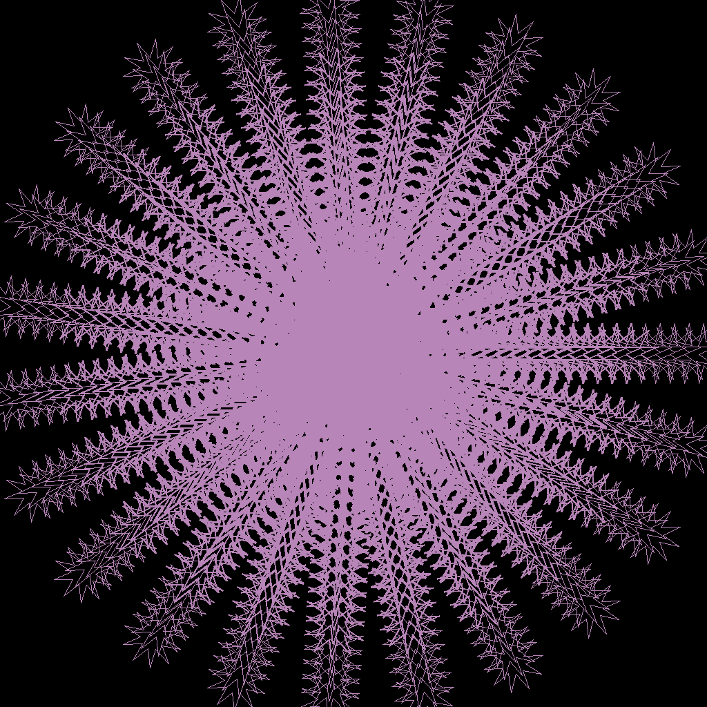

# 🌀 Quantum Complex Mandala Generator



## 📜 Overview
The **Quantum Complex Mandala Generator** is a Python-based script that creates **highly intricate and symmetrical mandalas** using **quantum entropy**. It leverages quantum measurements from **Rigetti’s PyQuil framework** to generate unique, visually stunning mandalas every time.

### 🔥 Features
✅ **Quantum-Based Randomness** – Generates unique mandalas using quantum entropy.  
✅ **Complex Symmetry** – Dynamically varies **radial symmetry** (8 to 36 divisions).  
✅ **Mixed Shape Patterns** – Uses **polygons, stars, circles, and arcs** for depth.  
✅ **Dark Themed & High Contrast** – Black background with **vibrant neon colors**.  
✅ **Scalable & High Resolution** – Output size: **1024x1024 pixels** (modifiable).  

---

## 📦 Installation

### 🔹 **1. Clone the Repository**
```bash
git clone https://github.com/yourusername/Quantum-Mandala-Generator.git
cd Quantum-Mandala-Generator
